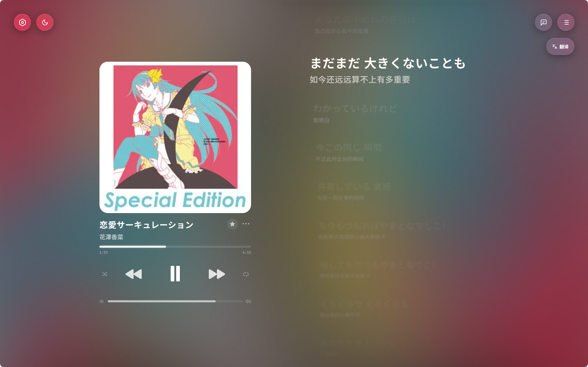

# IAN'S MUSIC

> 多平台桌面音乐播放器 — 支持 QQ 音乐、网易云音乐、酷狗、酷我、哔哩哔哩等多音源聚合播放

<p align="center">
  
</p>

IAN'S MUSIC 是一款基于 [Electron](https://www.electronjs.org/) 构建的跨平台桌面音乐播放器。它通过内置的 [Meting](https://github.com/metowolf/Meting) API 聚合多个音乐平台的搜索与播放能力，并集成了 AI 智能功能（歌曲解构、AI 翻译、AI 主题生成），为用户提供一站式的音乐聆听体验。

***

## 界面预览

<p align="center">
  
</p>

<p align="center">
  
</p>

<p align="center">
  
</p>

***

## 主要功能

### 音乐播放

- **多平台聚合搜索** — 一次搜索覆盖酷狗、网易云音乐、QQ 音乐、酷我、哔哩哔哩
- **在线试听** — 流媒体播放，支持多音源自动切换
- **本地音乐库** — 支持导入本地音频文件，构建个人音乐库
- **歌单导入** — 支持粘贴 QQ 音乐 / 网易云音乐歌单链接一键导入
- **播放模式** — 随机播放、列表循环、单曲循环
- **睡眠定时** — 可自定义时长的自动暂停

### 界面与视觉

- **视觉风格** — 流动渐变背景，随音乐律动
- **毛玻璃 UI** — 全界面 backdrop-filter 玻璃质感
- **AI 主题生成** — 输入描述词自动生成配色方案（由 DeepSeek 驱动）
- **多款主题色** — 内置色彩方案 + 自动取色模式
- **自适应布局** — 桌面端 + 移动端双模式，流畅切换

### 歌词系统

- **QRC 逐字歌词** — 支持 QQ 音乐逐字时间戳歌词
- **桌面歌词** — 独立悬浮歌词窗口
- **在线歌词搜索** — 多源歌词检索与手动更换
- **双语翻译** — AI 自动翻译 + 官方翻译兜底
- **歌词美化** — 居中/左对齐、字号可调、滚动动画

### AI 功能

- **歌曲解构 (Song Insight)** — 分析歌曲背景故事、编曲细节与情感
- **AI 歌词翻译** — 接入大语言模型进行歌词智能翻译
- **AI 主题生成** — 自然语言描述生成专属界面配色

### 其他

- **扫码登录** — 手机 APP 扫码自动获取 Cookie，提升音质
- **封面搜索** — 多源在线封面检索与更换
- **中英双语界面** — 一键切换，即时生效
- **PWA 支持** — 可在浏览器中作为渐进式 Web 应用使用

***

## 技术栈

| 类别 | 技术 |
| --- | --- |
| **框架** | Electron 33 |
| **前端** | 原生 HTML / CSS / JavaScript（无框架依赖） |
| **后端 API** | Node.js (Express) + Meting API |
| **数据存储** | localStorage / localforage |
| **构建** | electron-builder (NSIS 安装包) |
| **AI** | DeepSeek API（兼容 OpenAI 格式） |
| **歌词解密** | Triple DES（QQ 音乐 QRC 格式） |
| **PWA** | Service Worker + Manifest |

***

## 项目结构

```
IanMusic/
├── css/                    # 样式表
│   ├── variables.css       # CSS 变量 / 设计令牌
│   ├── components.css      # UI 组件样式
│   ├── desktop.css         # 桌面端布局
│   ├── mobile.css          # 移动端布局
│   └── icons.css           # 图标样式
├── js/                     # 前端 JavaScript
│   ├── app.js              # 主应用逻辑 & 入口
│   ├── player.js           # 音频播放控制
│   ├── playlist.js         # 歌单管理 & i18n
│   ├── lyrics.js           # 歌词渲染 & 解析
│   ├── ai.js               # AI 翻译 / 解构 / 主题
│   ├── config.js           # 配置 & 国际化字典
│   ├── ui.js               # UI 组件 & 弹窗
│   ├── theme.js            # 色彩主题管理
│   ├── visualizer.js       # 背景视觉器
│   ├── api.js              # 元数据 API 调用
│   ├── net-search.js       # 网络搜索 & 歌单导入
│   ├── mobile.js           # 移动端逻辑
│   ├── qr-login.js         # 扫码登录
│   └── lib/                # 第三方库
│       ├── jsmediatags.min.js
│       └── localforage.min.js
├── img/                    # 图片 & 图标资源
│   └── 效果图/              # 应用截图
├── build/                  # electron-builder 配置
│   ├── installer.nsh       # NSIS 安装器脚本
│   └── installerHeader.bmp
├── scripts/
│   └── build.bat           # 构建脚本
├── new-player/             # 新版播放器后端模块
├── meting-api/             # Meting API 服务
│   ├── server.js           # API 入口
│   ├── proxy.js            # 代理配置
│   ├── qrc-decrypt.js      # QQ 音乐 QRC 解密
│   └── lib/qrcode/         # 扫码登录二维码生成
├── test/
│   └── color-extraction.test.js
├── index.html              # 主页面
├── electron-main.js        # Electron 主进程
├── preload.js              # Electron 预加载脚本
├── sw.js                   # Service Worker (PWA)
├── manifest.json           # PWA 清单
├── package.json            # 项目配置
├── start.bat               # 开发启动脚本 (Windows)
├── build-app.bat           # 构建脚本 (Windows)
└── .gitignore
```

***

## 快速开始

### 环境要求

- **Node.js** >= 18
- **npm** >= 9
- **操作系统**: Windows / macOS / Linux

### 1. 克隆仓库

```bash
git clone https://github.com/your-username/ians-music.git
cd ians-music
```

### 2. 安装依赖

```bash
# 安装主项目依赖（Electron 等）
npm install

# 安装 API 服务依赖
cd meting-api && npm install && cd ..
```

### 3. 启动开发模式

**Windows:**

```bash
# Windows: 使用批处理脚本
start.bat

# 或手动启动
cd meting-api && node server.js &
npx electron .
```

### 4. 浏览器模式（PWA）

启动 API 服务后，直接用浏览器打开 `index.html`：

```bash
cd meting-api
node server.js
# 访问 http://localhost:3300
```

***

## 配置说明

### AI API 配置

在设置面板中配置 DeepSeek（或兼容 OpenAI 格式的）API：

| 参数 | 说明 | 示例 |
| --- | --- | --- |
| API Key | DeepSeek / SiliconFlow API 密钥 | `sk-xxxx...` |
| Base URL | API 地址 | `https://api.siliconflow.cn` |
| Model | 模型名称 | `deepseek-ai/DeepSeek-V3` |

国内推荐使用 [SiliconFlow（硅基流动）](https://cloud.siliconflow.cn)，注册即送额度。

### 音乐 API 配置

内置 Meting API 无需额外配置即可使用。如需更高音质或访问 VIP 内容：

1. **启动自建 API** — `cd meting-api && node server.js`
2. **填写 Cookie** — 在设置面板使用扫码登录功能获取平台 Cookie
3. **VIP 歌曲收听前提**：
   - 填写有效的 Cookie
   - 该 Cookie 关联的账号需已开通对应平台的 VIP 会员

***

## 构建安装包

```bash
# Windows
build-app.bat

# 或手动
npx electron-builder
```

构建产物在 `dist/` 目录下：

- `IANS_MUSIC_Setup_v{x.y.z}.exe` — Windows 安装包

***

## 免责声明

1. 本应用仅供学习研究使用，不得用于任何商业用途或侵权行为。
2. Cookie 为个人登录凭证，请勿泄露；建议定期更换密码保障账号安全。
3. VIP 歌曲收听需满足账号权限条件。
4. 使用本应用即表示您已了解并同意自行承担相关风险与责任。

***

## 许可证

本项目基于 [MIT License](LICENSE) 开源。

***

## 致谢

- [Meting](https://github.com/metowolf/Meting) — 多平台音乐 API 聚合框架
- [Electron](https://www.electronjs.org/) — 跨平台桌面应用框架
- [DeepSeek](https://www.deepseek.com/) — 大语言模型 API
- [SiliconFlow](https://www.siliconflow.cn/) — 国内 API 代理加速
- 各音乐平台提供的公开 API 接口
